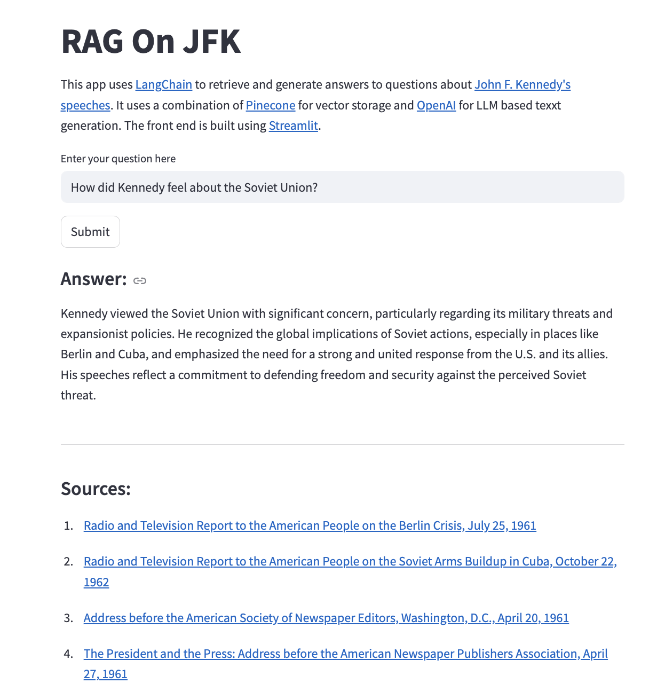

# RAG-JFK
------------
In this project I venture into building a [Retrivial Augmented Generation (RAG)](https://en.wikipedia.org/wiki/Retrieval-augmented_generation) application that has been "trained" on President John F. Kennedy speeches. In past posts I covered how I [collected JFK speeches](http://michael-harmon.com/blog/jfk1.html) and [built a "speech writer"](http://michael-harmon.com/blog/jfk2.html) using a [Gated Recurrent Unit (GRU) Neural Network](https://en.wikipedia.org/wiki/Gated_recurrent_unit). In this post I improve upon on the prior work to build a RAG pipeline to answer questions on President Kennedy based on his speeches.

## Part 1:
-----------------
The first blog post I cover how I collected speeches as well as their metadata using the [Asyncio](https://docs.python.org/3/library/asyncio.html) package to reduce run time when writing to object storage. Next, I will go over how to load the json files from [Google Cloud Storage](https://cloud.google.com/storage?hl=en) using different [LangChain](https://www.langchain.com/) loaders. After that I cover how to embed documents and ingest the data into a [Pinecone Vector Database](https://pinecone.io/).

## Part 2:
------------
In this post I will expand upon this work and build out a [Retrivial Augmented Generation (RAG)](https://en.wikipedia.org/wiki/Retrieval-augmented_generation) pipeline using [LangChain](https://www.langchain.com/). I first cover how RAG pipeliens work and how to use the [Pinecone Vector Database](https://pinecone.io/) as a retriever to generate documents related to a users question. Then I go over how to use the LLM and the retrieved documents to generate an answer to the question. Lastly, I cover how deploy this as a [Streamlit](https://streamlit.io/) application to be able to answer questions on President Kennedy. An example of what this application looks like is below,

